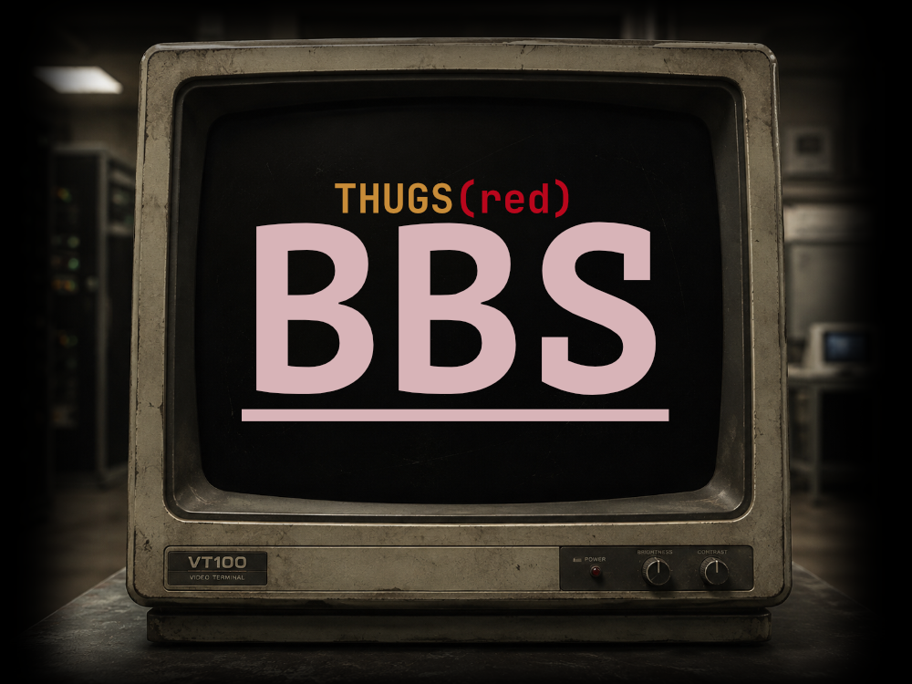
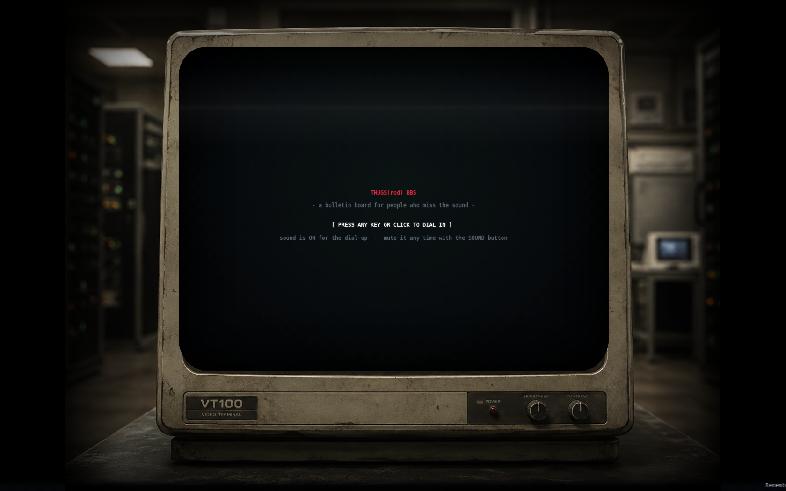
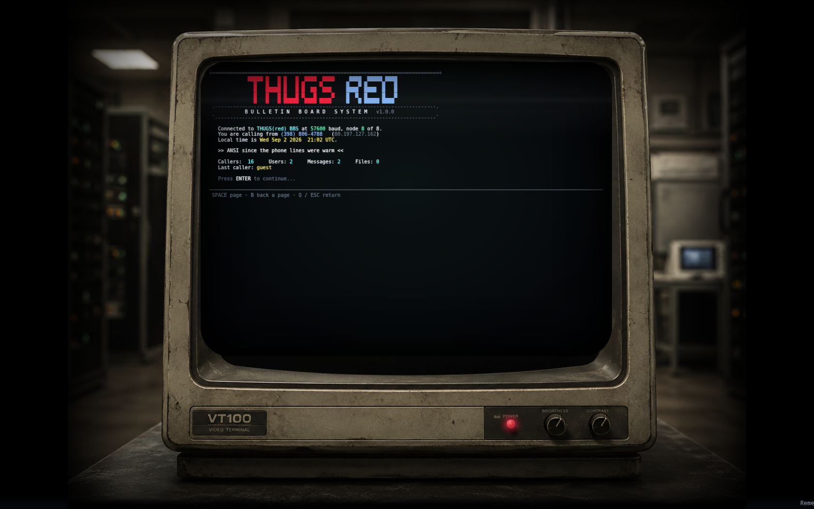
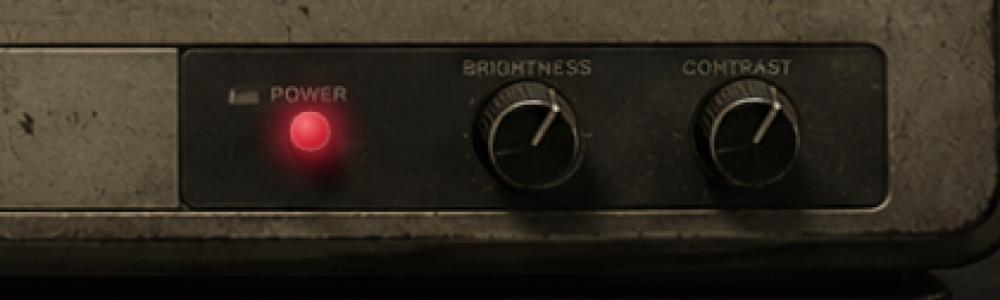

<p align="center">
  
</p>

<h1 align="center">THUGS(red) BBS</h1>

<p align="center">
  <em>A keyboard-driven ANSI / ASCII bulletin board system that runs inside a CRT — on the web.</em><br>
  <a href="https://bbs.thugs.red"><strong>bbs.thugs.red</strong></a>
</p>

<p align="center">
  
  
  
  
  
</p>

---

Dial in and you get the whole ritual: the monitor powers on, a BIOS POST scrolls
by, `ATDT` tones out **your own IP address rendered as a phone number**, a
synthesised modem screams through its handshake, `CONNECT 57600` prints, and
`telnet bbs.thugs.red` auto-types you into a full bulletin board — messages,
files, door games, node chat, a live news wire, a voting booth, a SysOp area —
all ANSI, all 256-colour, all driven from the keyboard, all living inside the
glass of a real CRT with working brightness and colour knobs and a power button.

<p align="center">
  
  
</p>

## What's in the box

| | |
|---|---|
| **Terminal** | 132×50 grid scaled to fill the monitor glass · CP437 web font · scanlines, vignette, flicker, roll-bar, barrel curvature, power-on collapse |
| **Sound** | 100% synthesised WebAudio — DTMF dialing, carrier + handshake, key clicks, bell, flyback whine, relay clunk. No sample files. |
| **Boot** | power-on → POST → `ATZ`/`ATDT` → modem → `CONNECT` → `telnet …` |
| **Messages** | conferences → boards → threads · post / reply / quote · scan-new · FULLTEXT find · sender IP shown as `Calling from: (415) 203-1174` |
| **Files** | libraries with rank gates · SHA-256 · streamed downloads (RBAC + audit) · upload + SysOp approval queue · reference-link library |
| **News wire** | live RSS/Atom — IT (The Register), Hacking (BleepingComputer, Krebs), Tech (Ars, HN), Entertainment (Variety, Polygon) |
| **Games** | Guess The Number · Hangman · Ten Thousand · Blackjack · Hunt The Wumpus · Legend of the Red Console — with a hall of fame |
| **More** | node chat · one-liner wall · voting booth · user list / who's online · stats · SysOp tickets |
| **SysOp area** | users & RBAC · content CRUD · **live screen + menu editor** · global config · Discord webhooks · full **audit log** · **call log** |
| **Under it** | MariaDB (the whole board) · Redis (optional cache/pubsub) · beanstalkd (optional jobs, DB fallback) · libsodium-encrypted PII · `.htaccess` CSP/CORS · sitemap, OG cards, JSON-LD, fancy deep links |

<p align="center"></p>

## Quick start

### Bare metal / shared host

```bash
git clone git@github.com:kawaiipantsu/bbs.git && cd bbs
cp app/config.sample.php app/config.php   # DB creds + 3 crypto keys
chmod 640 app/config.php
mkdir -p storage/{files,cache,tmp,logs}
chown -R www-data:www-data .
php mysql/migrate.php --seed              # schema + demo content + first SysOp
# point the vhost DocumentRoot at html/  — done.
```

Log in as `sysop` (password from `app/config.php`, forced change on first login).
Optional: `cp contrib/bbs-worker.service /etc/systemd/system/ && systemctl enable --now bbs-worker`.

### Docker (try it in 30 seconds)

```bash
docker compose -f docker/docker-compose.yml up --build
#   http://localhost:8080     sysop / letmein
```

Needs nothing but Docker — MariaDB, Redis and beanstalkd come up with it, and
`config.sample.php` reads the `BBS_*` env vars the compose file sets.

## How it works

The browser is a **thin terminal**. It sends one keystroke at a time to
`POST /api/action`; PHP walks a navigation stack, renders the screen as an array
of styled *runs* (never HTML), and the client paints them onto a `<span>` grid.
Menus and screens are **rows in the database**, so the SysOp reshapes the board
live. Full write-up in **[docs/architecture.md](docs/architecture.md)**.

```
docs/       project · architecture · infrastructure · install · features
            technology · api · sysop · security · assets
mysql/      schema.sql · seed.sql · migrate.php · migrations/
contrib/    worker.php · maintenance.php · bbs-worker.service · crontab
docker/     Dockerfile · docker-compose.yml · entrypoint.sh
assets/     identity masters + generate.php
app/        the application (not web-served)
html/       the only web root
storage/    user files & cache (mount a disk here; outside the web root)
```

## Docs

[Project](docs/project.md) ·
[Architecture](docs/architecture.md) ·
[Infrastructure](docs/infrastructure.md) ·
[Install](docs/install.md) ·
[Features & hotkeys](docs/features.md) ·
[Technology](docs/technology.md) ·
[HTTP API](docs/api.md) ·
[SysOp guide](docs/sysop.md) ·
[Security](docs/security.md) ·
[Assets](docs/assets.md)

## License

MIT — see [LICENSE](LICENSE). Bundled terminal font is a CP437 subset of DejaVu
Sans Mono (free to redistribute). The CRT photo and banner are project assets.

<p align="center"><sub>built for <a href="https://thugs.red">thugs.red</a> · NO CARRIER</sub></p>
